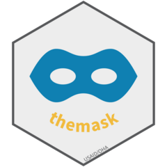

## themask 
<!-- badges: start -->
[](https://github.com/USAID-OHA-SI/themask/actions/workflows/R-CMD-check.yaml)
<!-- badges: end -->


Masks and houses the PEPFAR MSD-style training dataset for testing/training

## Overview

This repository houses the PEPFAR MSD-style training dataset to use for testing and public facing work. This is a masked, dummy dataset that should be used for testing, training, and demoing instead of using actual data. For more information on the MSD, check out the Users Guide and Data Dictionary on [PEPFAR Panorama](https://pepfar-panorama.org/) (found in the Downloads folder under MER).

## Installation

`themask` is not on CRAN, so you will have to install it directly from GitHub using `pak`.

If you do not have `pak` installed, you will have to run the `install.packages("pak")` line in the code below as well.


``` r
## SETUP

  #install package with vignettes
    install.packages("pak")
    pak::pak("USAID-OHA-SI/themask")
    
  #load the package
    library(themask)

## LIST TYPES OF STYLES INCLUDED WITH PACKAGE
  ls('package:themask')
```

---

*Disclaimer: The findings, interpretation, and conclusions expressed herein are those of the authors and do not necessarily reflect the views of United States Agency for International Development. All errors remain our own.*
