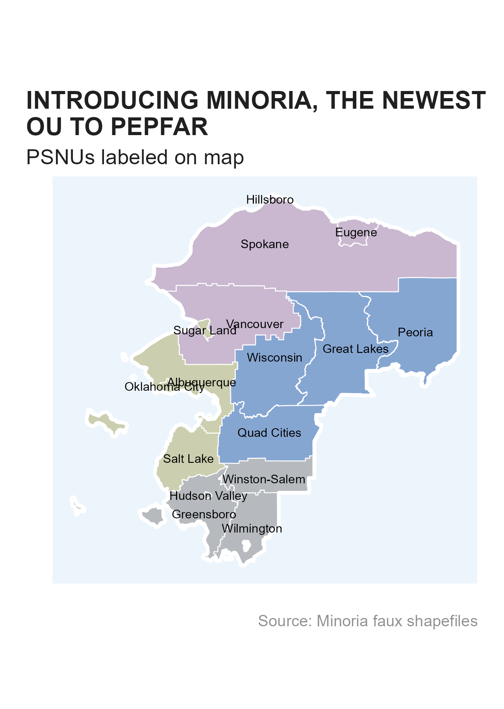

```{r, include = FALSE}
knitr::opts_chunk$set(
  collapse = TRUE,
  comment = "#>"
)
```

## Introduction

In OHA/SI, we our days are filled with pouring over MER Structure Datasets (MSD). These data help inform programming and to make policy decisions, largely through visualization to communicate our analyses. MER data are not publicly available in the forms we have access to.work with, which makes it challenging to share work products, develop training material, or test database schemas. To alleviate these concerns while keeping true to our dataset structure, we have developed a masked data that can easily be supplemented or stand in place of the MSD. 

The training dataset is masked with geographic and team names from [Minor League Baseball](https://en.wikipedia.org/wiki/Minor_League_Baseball#Leagues_and_affiliations) to stand in for `snu1`, `psnu`, `mech_name` and `prime_partner_name`. Other unique identifies, e.g. "uids", have been generated (`msk_gen_uid()`) or in more limited cases have been striped out entirely. The masked operating unit/country is the Kingdom of Minoria, which consists of four regions, `snu1`, each with four districts, `psnu` (`minoria_geo`). 

```{r map, echo=FALSE, message=FALSE, warning=FALSE, eval=FALSE}

# library(ggplot2)
# library(themask)
# library(glitr)

# ggplot() +
#   geom_sf(data = minoria_shp_psnu, aes(geometry = geometry, fill = snu1), color = "white", linewidth = 0.25, alpha = 0.5) +
#   geom_sf(data = minoria_shp_ou, aes(geometry = geometry), fill = NA, color = "white", linewidth = 1) +
#   geom_sf_text(data = minoria_shp_psnu, aes(geometry = geometry, label = psnu), size = 7/.pt) +
#   scale_fill_si(palette = "siei", discrete = TRUE) +
#   scale_color_si(palette = "siei", discrete = TRUE) +
#   si_style_map() +
#   labs(x = "", y = "", title = "INTRODUCING MINORIA, THE NEWEST OU TO PEPFAR",
#        subtitle = "PSNUs labeled on map",
#        caption = "Source: Minoria faux shapefiles") +
#   theme(panel.background = element_rect(fill = "#edf5fc", color = "white"),
#         legend.position = "none")
# 
# si_save("vignettes/minoria_map.png", width = 5)

```
```{r display_map, echo=FALSE}

```


The data consist of only indicators from the PEPFAR HIV clinical cascade (see `gophr::cascade_ind`). 

## Accessing Data

Since these data have been masked, we are able to [host them publicly on our GitHub repository via releases](https://github.com/USAID-OHA-SI/themask/releases). Each quarter, we will do our best to update here for your use. To view the PEPFAR MSD schedule, see `glamr::pepfar_data_calendar`. There are a few different ways for you at access the data to start using them.

### R

The easiest way to access the data are directly from R using this package. We have built a wrapper around the `piggyback` package to work with releases. You can use  `msk_available()` to check the latest masked MSD version available and then `msk_download()` to download the data. The `msk_available()` will give you a warning if there is a newer MSD available if you want to create your own version.

```{r setup, message=FALSE, warning=FALSE}

#Install packages from
remotes::install_github("USAID-OHA-SI/gophr")
remotes::install_github("USAID-OHA-SI/glamr")

#Load Dependencies
library(themask)
library(dplyr)
library(gophr)
library(glamr)
```

```{r check}
#check if you have the latest version available
msk_available()
```

From the file path, we can see the date and version in the file name which will match the MSD releases. From this file, we can see that the latest masked version available is from 2023-09-15, which is from Q3, and the v2 indicates this is the quarter's clean version (as opposed to the initial which would be v1). 


To download, we can just run `msk_download()`.

```{r download}
#download folder path
download_folder <- temp_folder()

#download
msk_download(download_folder)
```
In the above example, we could have specified the param `launch = TRUE` which opens up the Window's folder specified automatically. The other parameter not used is the `tag`, which you can use to [specify an older, available version](https://github.com/USAID-OHA-SI/themask/releases) to use, e.g. `tag = 2023.05.31.i`.

To load the data into R, you can use your normal `gophr::read_psd()` to get going.

```{r read}

df_msd <- return_latest(download_folder, "PSNU_IM") %>% 
  read_psd()

glimpse(df_msd)

```

Also note that if you use the masked dataset, you can use `gophr::get_metadata()`, specifying the path to the file and it will provide information about the masked dataset you can use in the caption for your plot or other documentation.

```{r meta}

get_metadata(download_folder, "PSNU_IM")

metadata

```

### Manual

For those not using R, fear not! You can use these data as well. Instead of having a direct function to do these things, you can manually navigate to the [Releases page](https://github.com/USAID-OHA-SI/themask/releases) on GitHub. There, you will want to click on the [release tagged "latest"](https://github.com/USAID-OHA-SI/themask/releases/tag/latest). You can then select the MSD to download it and use it as you normally would a MSD. 


## Creating a Masked MSD

If you run `msk_available()` and it is out of date, or you want to create a masked NAT_SUBNAT dataset, you can create your own if you have the full [MSD or NAT_SUBNAT dataset](https://pepfar-panorama.org/forms/downloads/). 

```{r create, eval = FALSE, echo=TRUE}

#path to local NAT_SUBNAT dataset
subnat_path <- si_path() %>% return_latest("NAT_SUBNAT")

#store a masked NAT_SUBNAT dataset
msk_create(subnat_path, "../Documents/Data")

#generate a masked NAT_SUBNAT dataset to load to your session
df_masked <- msk_create(subnat_path)

```

## Mapping

In addition to the masked MSD files produced, we have also created shapefiles that can be used for mapping. 

### R

Within `themask` package itself, we have a few `sf` dataframes that can be interacted with and plotted - `minoria_shp_ou`, `minoria_shp_snu1`, `minoria_shp_psnu`. 

```{r mapping, message=FALSE, warning=FALSE, eval=FALSE}

library(ggplot2)
library(glitr)
library(themask)

ggplot() +
  geom_sf(data = minoria_shp_psnu, aes(geometry = geometry, fill = snu1), color = "white", linewidth = 0.25, alpha = 0.5) +
  geom_sf(data = minoria_shp_ou, aes(geometry = geometry), fill = NA, color = "white", linewidth = 1) +
  geom_sf_text(data = minoria_shp_psnu, aes(geometry = geometry, label = psnu), size = 7/.pt) +
  scale_fill_si(palette = "siei", discrete = TRUE) +
  scale_color_si(palette = "siei", discrete = TRUE) +
  si_style_map() +
  labs(x = "", y = "", title = "INTRODUCING MINORIA, THE NEWEST OU TO PEPFAR",
       subtitle = "PSNUs labeled on map",
       caption = "Source: Minoria faux shapefiles") +
  theme(panel.background = element_rect(fill = "#edf5fc", color = "white"),
        legend.position = "none")

```

```{r display_map2, echo=FALSE}

```
### Manual

The shapefile can also be downloaded manually for use in your GIS software of choice, e.g. ArcGIS, QGIS, Tableau. You can download these files from the repository's Releases page, clicking on the [release tagged "shapefiles"](https://github.com/USAID-OHA-SI/themask/releases/tag/shapefiles). Download the zip file(s) you need and unzip them to start using them with your mapping software.
